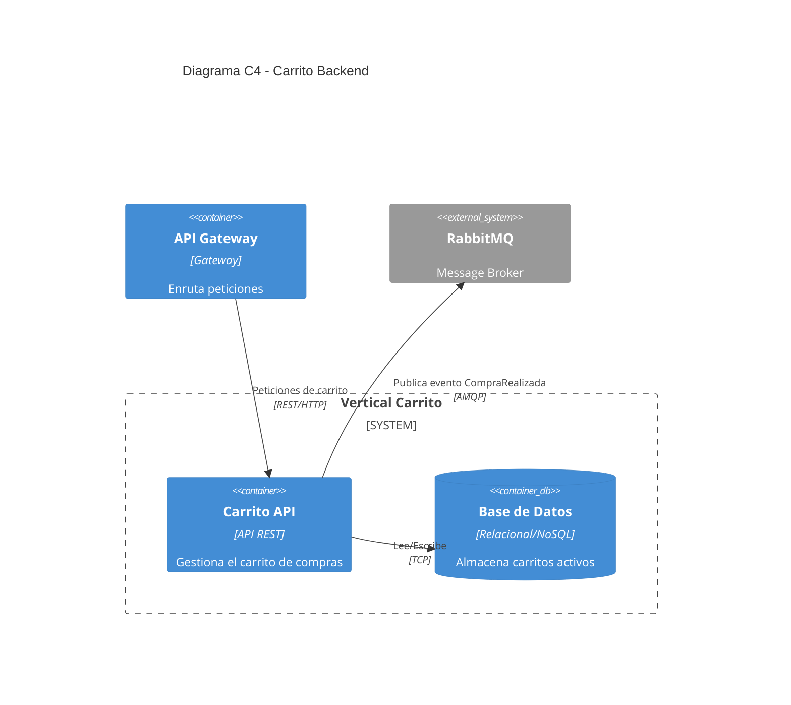

# Carrito Backend

## Descripción de Propósito
Este vertical gestiona el carrito de compras de los clientes. Permite agregar películas, quitarlas, visualizar el subtotal/total aplicando descuentos, y finalmente realizar la compra (checkout).

## Servicios que Expone vía HTTP
- `GET /carrito`: Obtiene los ítems actuales del carrito del usuario autenticado.
- `POST /carrito/item`: Agrega una película al carrito.
- `DELETE /carrito/item/{id}`: Quita una película del carrito.
- `POST /carrito/checkout`: Confirma la compra del carrito actual.

## Eventos que Publica o Consume (RabbitMQ)
- **Publica**: Evento `CompraRealizada` cuando un cliente ejecuta el checkout de su carrito exitosamente.

## Diagramas C4

